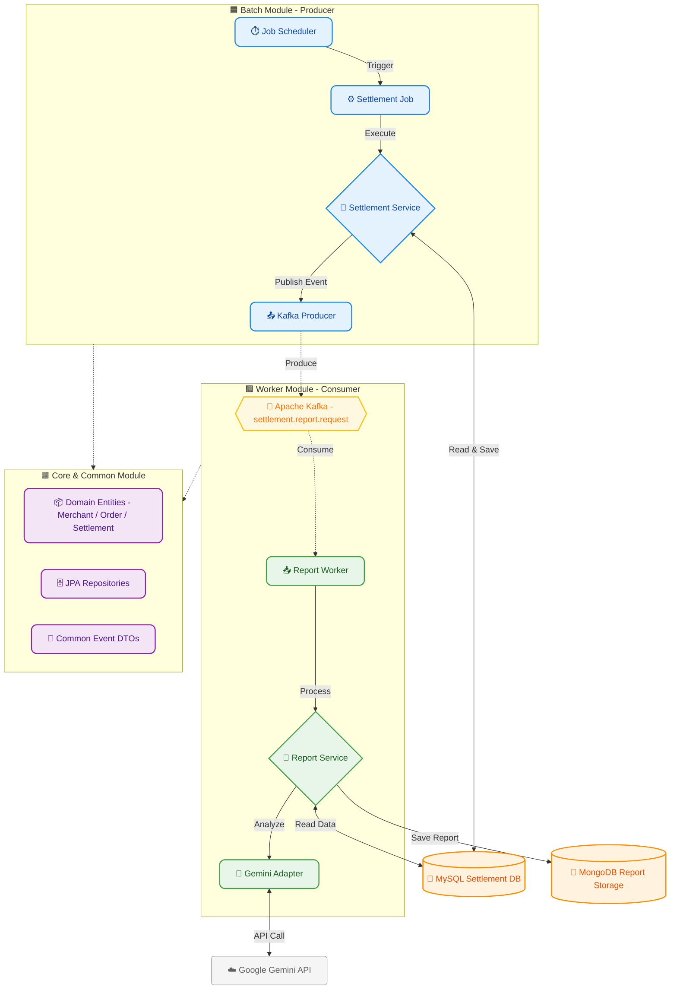

# 💰 Merchant Settlement & Insight System (MSS)

---

## 📖 개요 (Overview)

**"단순한 정산을 넘어, 가맹점주에게 데이터 기반의 통찰(Insight)을 제공하다."**

MSS는 대규모 이커머스 환경에서 **가맹점별 정산 금액을 정확하게 계산**하고, 생성형 AI(Google Gemini)를 활용하여 **매출 추이 분석 리포트**를 자동으로 생성 및 발송하는 시스템입니다.

대용량 데이터 처리의 안정성을 위해 **멀티 모듈 아키텍처**와 **이벤트 기반 아키텍처(Kafka)**를 도입하여, 정산 처리(Batch)와 리포트 생성(Worker)의 관심사를 물리적으로 분리했습니다.

---

## 🏗️ 시스템 아키텍처 (Architecture)

헥사고날 아키텍처 원칙을 준수하여 도메인 로직을 격리하고, 역할에 따라 모듈을 분리했습니다.   

시스템은 크게 **데이터 생성(Producer)**과 데이터 처리(Consumer), 그리고 이를 뒷받침하는 공통 모듈로 구성되어 있습니다.

### 1️⃣ Batch Module (Producer) - 정산 및 이벤트 발행
정산 배치를 실행하고 결과 이벤트를 발행하는 영역입니다.
- `job Scheduler`: 정해진 시간에 정산 배치 작업을 트리거합니다.
- `Settlement Job`: 대용량 데이터를 읽고 처리하는 Spring Batch Job을 실행합니다.
- `Settlement Service`: 비즈니스 로직을 수행하여 정산 금액을 계산합니다.
  -  Read: `MySQL` 에서 가맹점 및 주문 데이터를 조회합니다.
  -  Save: 계산된 정산 결과를 MySQL(settlements 테이블)에 영속화합니다.
- `Kafka Producer`: 정산이 완료되면 `settlement.report.request` 토픽으로 이벤트를 발행합니다.

### 2️⃣ Middleware - 메시지 브로커
시스템 간의 결합도를 낮추고 비동기 처리를 보장합니다.   
- `Apache Kafka`: 배치와 워커 사이의 데이터 파이프라인 역할을 수행합니다.
  - Topic: `settlement.report.request`(정산 완료 이벤트)

### 3️⃣ Worker Module (Consumer) - AI 분석 및 리포트 생성
이벤트를 수신하여 AI 분석을 수행하고 리포트를 저장/발송하는 영역입니다.
- `Report Worker`: Kafka 토픽을 구독(Subscribe)하며 메시지를 수신합니다.
- `Report Service`: 리포트 생성의 핵심 비즈니스 로직을 제어합니다.
- `Google Gemini API`: 주문 데이터를 분석하여 매출 추이와 인사이트 텍스트를 생성합니다.
  - Analyze: 프롬프트를 전송하여 AI 분석 요청.
  - Insight Text: 분석 결과를 텍스트로 수신.
- `MongoDB`: AI가 생성한 비정형 리포트 데이터를 저장합니다. (`settlement_reports` 컬렉션)

### 4️⃣ Core & Common Modules - 공통 자원
- `Core Modules`: 도메인 엔티티와 영속성 계층을 관리합니다.
  - MySQL JPA Entity 및 Repository 포함
- `Common Modules`: 시스템 전반에서 사용되는 데이터 전송 객체와 유틸리티를 제공합니다.

---
## 💡 문제 정의 및 해결 (Case Study)
### 1️⃣ 문제: 정산 로직과 외부 API 호출의 강한 결합
AS-IS (기존 방식)
- 정산 배치가 끝난 직후, 동일한 트랜잭션 안에서 리포트를 생성하고 외부 API(AI)를 호출함.
- 외부 API 장애(Timeout, 500 Error) 발생 시 핵심 정산 로직까지 롤백되거나 전체 배치가 실패하는 위험 존재.
- 단일 프로세스에서 처리하므로 정산량이 늘어날수록 전체 실행 시간이 기하급수적으로 증가.

TO-BE (해결책)
- 이벤트 기반 아키텍처(Event-Driven Architecture) 도입
- 정산 배치는 정산 데이터 생성 후 Kafka에 이벤트를 발행하고 즉시 종료.
- 리포트 워커가 이벤트를 구독하여 비동기적으로 AI 분석 및 발송 수행.
- 결과: 외부 API 장애가 발생해도 정산 데이터는 안전하게 보존되며, 실패한 리포트 작업만 재시도 가능.

### 2️⃣ 문제: 정형 데이터와 비정형 데이터의 혼재
AS-IS
- 정산 데이터(금액, 날짜)와 AI가 생성한 긴 텍스트 리포트를 하나의 RDB 테이블에 저장.
- 리포트 내용이 길어질수록 DB I/O 성능 저하 및 스키마 변경의 유연성 부족.
- 
TO-BE
- Polyglot Persistence (다중 저장소) 전략
- MySQL: 트랜잭션 보장이 중요한 `주문`, `가맹점`, `정산` 데이터 관리.
- MongoDB: AI가 생성한 가변적인 길이의 텍스트와 리포트 문서는 Document DB에 저장.
- 결과: 데이터 특성에 맞는 최적의 저장소를 사용하여 조회 성능 및 확장성 확보.

---
## 💻 핵심 기능 (Key Features)
### 1. 정산 기준 및 데이터 생성 로직 (SettlementCalculator)
정산 금액은 단순 매출 합계가 아니며, 아래 4가지 핵심 요소를 반영하여 정교하게 계산됩니다.
1. 매출 집계 (Revenue Aggregation):
   - `총 매출` = `상품 판매 금액` + `배송비` (가맹점이 배송비를 지원하는 경우만 포함)

2. 공제 항목 (Deductions):
   - `플랫폼 수수료` = (`상품 판매 금액` - `가맹점 부담 할인액`) * `수수료율`
   - `PG 수수료` = `최종 결제 금액` * `PG 수수료율`
   - `부가세(VAT)` = (`플랫폼 수수료` + `PG 수수료`) * 10%

3. 세금 처리 (Taxation):
   - `원천징수세` = `개인 사업자`인 경우에만 정산 대상 금액의 3.3% 차감 (법인 사업자는 제외)

4. 최종 지급액 (Payout Amount):
   - `지급액` = `총 매출` - `가맹점 부담 할인` - `수수료 합계` - `부가세` - `원천징수세`

### 2. 정산 주기 및 영업일 자동 계산 (BusinessDayPolicy)
- T+7 정산 정책: 주문 확정(구매 확정)까지 걸리는 시간을 고려하여, 주문일로부터 7일이 지난 건에 대해서만 정산을 수행합니다.
- 영업일 보정: 주말이나 공휴일에는 정산이 이루어지지 않으며, 다음 영업일에 지난 휴일 분의 정산 건을 합산하여 처리합니다.

### 3. AI 기반 매출 분석 리포트 (Generative AI)
- 단순한 금액 통보가 아닌, 주문 데이터를 일별로 분석하여 인사이트를 제공합니다.

---
## 🛠️ 기술 스택 (Tech Stack)
- Language: Kotlin (JDK 21)
- Framework: Spring Boot 3.5.8, Spring Batch, Spring Integration (Redis Lock)
- Messaging: Apache Kafka 3.9, Zookeeper
- Database: MySQL 8.0 (JPA), MongoDB 6.0, Redis 7.0
- AI: Google Gemini 2.0 Flash
- Build & Deploy: Gradle (Kotlin DSL), Docker Compose
